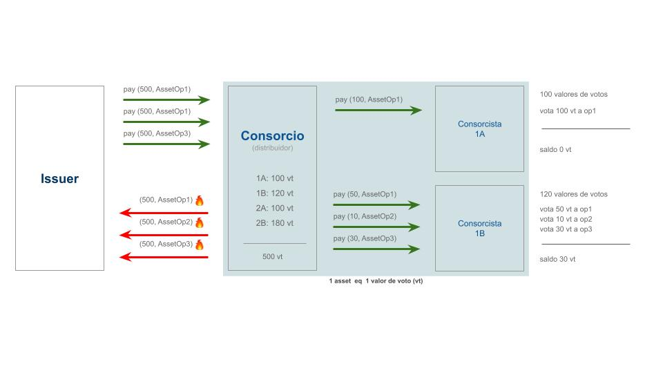

# votechain
Proyecto sobre la red Stellar para el hackathon de r/argentina-programa.
## install 🔧
``` npm install ```

## run
``` npm run dev ```
## Uso
Para probar la app con sus funcionalidades básicas puede usar estos [requests](https://www.getpostman.com/collections/26a9902f313e7e486e86).

## Declaración

Sistema de votaciones online, dirigido a las administraciones de consorcios de edificio, que permite resolver de forma ágil la toma de decisiones en relación a propuestas que podrían ser derivadas ya sea de asambleas, iniciativas de consorcistas individuales o grupales, o directamente de la administración del consorcio.
El sistema busca fomentar la participación de los vecinos y lograr mayor transparencia sobre las acciones que llevan a cabo los consorcios.
### Ejemplos de uso:
- Definir un cierto aumento en el valor de las expensas dirigido al gasto en mantenimiento del parque (origen: administración).
- Definir un proveedor de cierto servicio imprescindible para el mantenimiento de las instalaciones (origen: asamblea). Ej.: calderista,  plomero, electricista, etc.
- Definir una necesidad para que sea objeto de votación (origen: consorcista/s).

### LÓGICA DE NEGOCIO

- Una vez formulada una propuesta, el consorcio se encargará de publicarla para dar inicio a la votación.

- Si bien el consorcio podría publicar más de una propuesta y que las votaciones respectivas convivan en un mismo período de tiempo, provocando la existencia de votaciones simultáneas, por el momento y por simplicidad el consorcio quedará restringido a la acción de publicar solo una propuesta a la vez, logrando así la existencia de una única votación abierta por vez.

- Por cada votación se generarán tantos assets como opciones de voto tenga la votación.
     - Cada consorcista puede tener un peso determinado en la votación  (por ejemplo, por los m2 de la unidad de la que es responsable). Lo que se traduce en más valores de voto.
     - Los consorcistas pueden estar o no habilitados para participar en la votación.
     - Cada votación podrá requerir, dependiendo la propuesta, un mínimo de consorcistas participantes para que sea considerada válida.
     - Cada votación tendrá un tiempo de finalización.

- Sobre una votación particular, los consorcistas tendrán la posibilidad de votar diferentes opciones usando parte de los valores de voto que les fueron otorgados.
     - Podrán votar más de una vez, en tanto dispongan de “saldo” y el  tiempo de finalización de la votación no se haya alcanzado.
     - Solo podrán votar una única vez una opción.
     - Una vez que se haya realizado un voto, tal acción no podrá deshacerse.

- Finalizada la votación
     - Los assets generados para la propuesta que fue votada quedan en desuso.
     - Si la votación es considerada válida se emitirán los resultados. De lo contrario, se expondrán los motivos de la invalidez.


### Secuencia básica del sistema

1. Un cliente consorcio entra a la app y se **registra**.
    - Se crea un *Consorcio* y tantos *Consorcistas* como hayan sido declarados en el registro.
    - Se crean las respectivas cuentas de Stellar correspondientes a cada instancia de Consorcio y Consorcista.

2. Un cliente consorcio crea una **votación/encuesta** dirigida a los consorcistas registrados en su cuenta.
    - Se procesan los datos y se crea una *Votación*.
    - Se depositan en la cuenta Stellar del Consorcio las cantidades necesarias de los assets creados específicamente para ser utilizados como valores de votos en esta votación. Se crean tantos assets como opciones de voto tenga la votación.

                            cantidad de opciones * Σ vt = total assets emitidos 

3. Se **inicia la votación**.
    - Los consorcistas **ingresan** a la app para votar.
    - Un consorcista realiza un **voto** que puede ser pleno o parcial si existieran más de dos opciones en la votación. Si el voto es parcial, aún poseerá valores de voto por lo que puede volver a votar.
    - Cada vez que se realice un voto se emitirá un pago desde la cuenta Stellar del Consorcio a la cuenta Stellar del Consorcista con la cantidad indicada del asset asociado a la opción por la que se está votando.

4. **Finaliza la votación**.
    - Se depositan (se queman) en la cuenta ISSUER todos los assets creados para la votación, emitiendo pagos desde las cuentas que al momento de finalización tengan posesión del asset.

5. Se muestran los **resultados** de la votación.


## Esquema básico




## Autores


